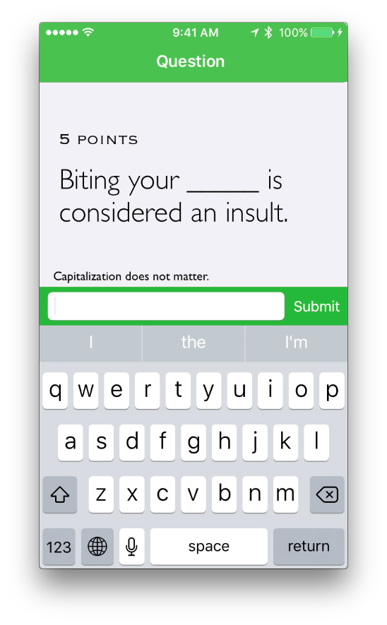

### Introduction
This is an app I created for my English class in my freshmen year of high school (2013-14) with a friend. I've uploaded it for legacy purposes. The basic premise is a simple jeopardy game with fill in the blank, true/false, and multiple choice questions, centered around Romeo & Juliet lore. The game can also handle scorekeeping for two teams.

## Screenshots

* Starting a new game:

* Selecting a question:

 

* Answering a multiple choice question:

* Changing the type of questions shown:

* Answering a true/false question:

* Getting a wrong answer:

* Answering a fill in the blank question:

